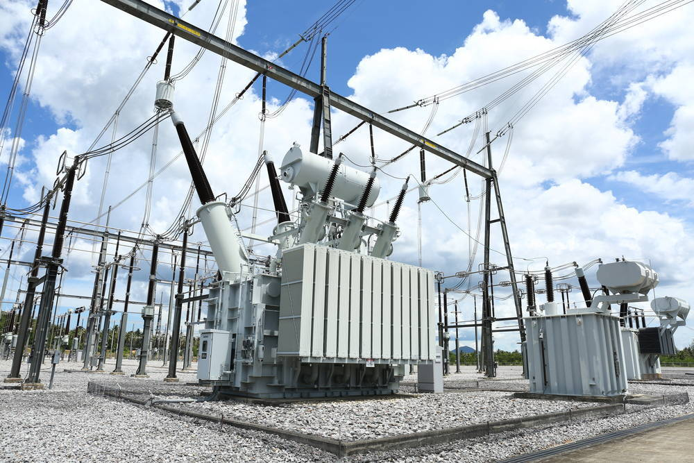
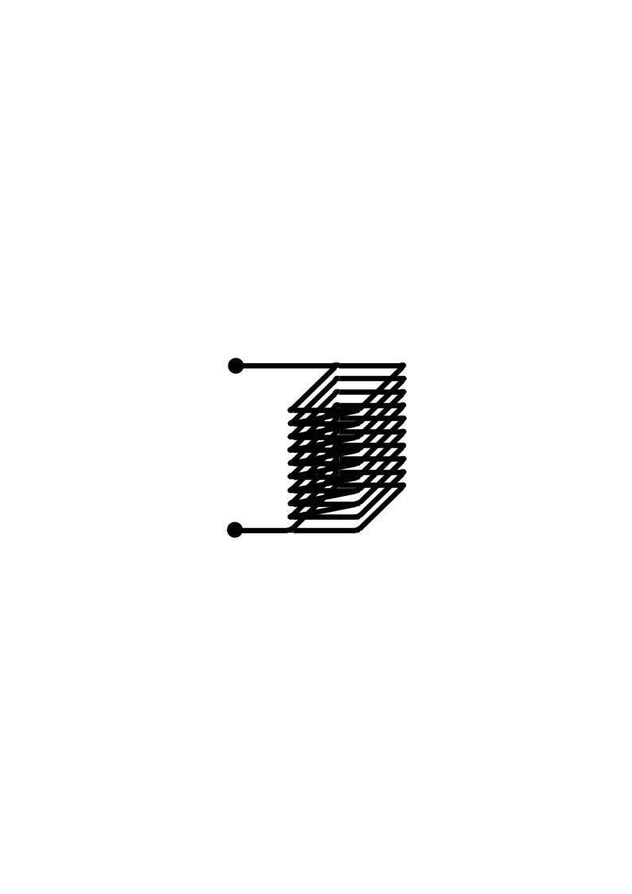
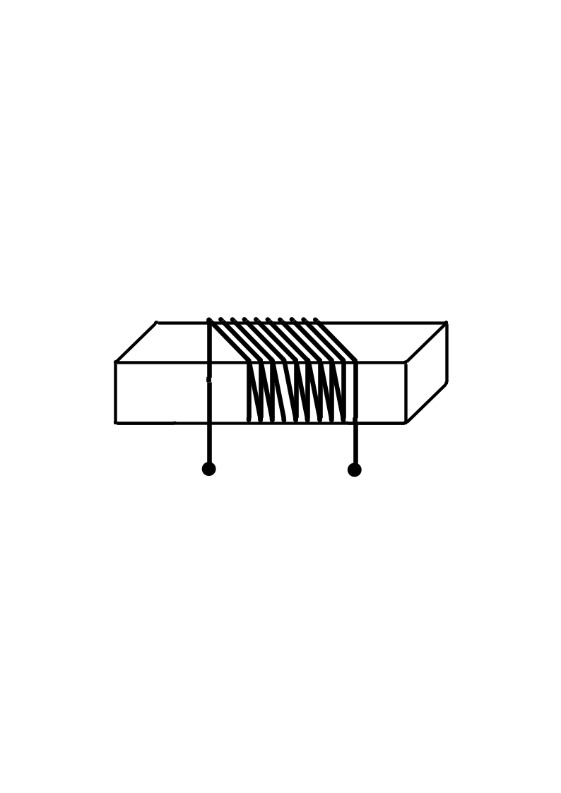
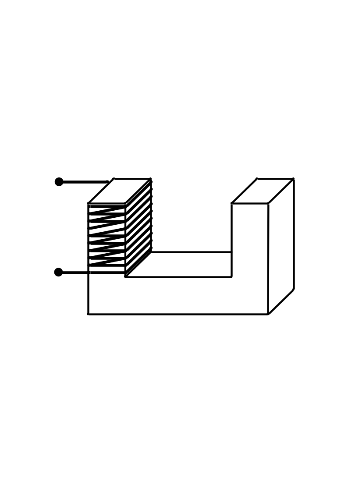
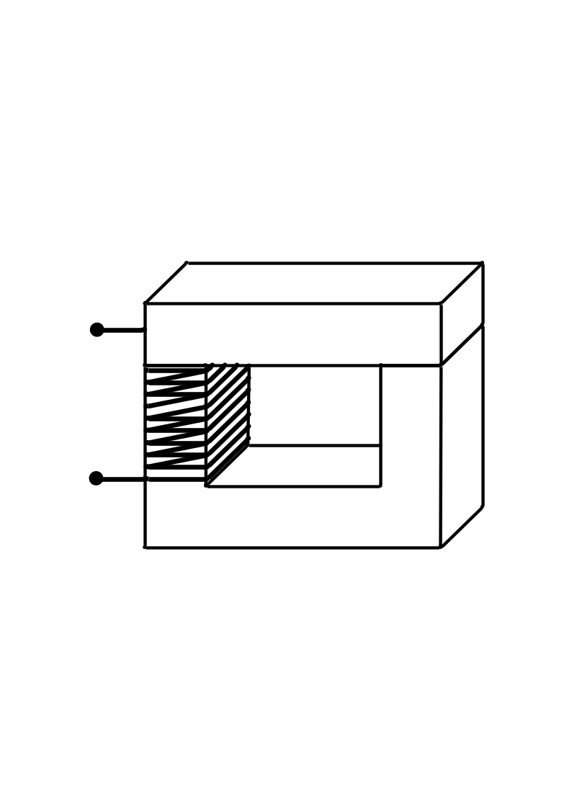
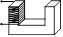

**[Circuitos Magnéticos]{.underline}**

{width="4.113043525809274in" height="2.7460498687664043in"}

***Fig. 1 Transformador monofásico***

# OBJETIVOS A LOGRAR:

-   Experimentar el comportamiento de los parámetros eléctricos en circuitos magnéticos con distintos tipos de núcleos, bajo la influencia de corriente alterna y continua.

# FUNDAMENTO TEORICO:

El circuito magnético en analogía a un circuito eléctrico es el trayecto L~n~ por el cual circula un flujo magnético Ø (análogo a la corriente eléctrica I) y que tiene una Reluctancia (ℛ) (análoga a la resistencia eléctrica) producida por una fuerza magneto motriz fmm (análoga a la diferencia de potencial).

La relación entre las variables de un circuito magnético está dada por la ecuación de Hopkinson.

> $$fmm\mathcal{= R \bullet \varnothing}$$

La fuerza magneto motriz depende del número de espiras (N) de la bobina y la corriente que circula por ella I (puede ser alterna o continua), estando dada por:

> $$fmm = N \bullet I$$

La reluctancia depende de la longitud del circuito magnético (L~n~), la permeabilidad magnética (μ), propiedad de cada material y la sección transversal del circuito magnético (A):

> $$\mathcal{R =}\frac{1}{\mu}\frac{L_{n}}{A}$$

# ACTIVIDADES A DESARROLLAR

a.  Evaluar circuitos magnéticos con corriente alterna y continua, con núcleo de aire y con núcleo de acero al silicio laminado y diversos entrehierros.

b.  Resolver las preguntas propuestas en función de los datos obtenidos en el laboratorio.

# PROCEDIMIENTO

#### CIRCUITO MAGNETICO

Esta experiencia es demostrativa con la intención de que puedan investigar y fundamentar el comportamiento del circuito magnético en cuanto a la intensidad del campo magnético y de qué parámetros depende.

Para ello se les asignara una bobina de la cual deben tomar los datos de:

-   Numero de vueltas.

-   Corriente máxima admisible de la bobina

-   Dimensiones de la bobina.

-   Dimensiones del núcleo de planchas de acero al silicio en forma de "U"

-   Dimensiones del núcleo de planchas de acero al silicio en forma de prisma rectangular

Instalar la bobina a la borneras de conexión y disponer los instrumentos para realizar la medición de voltaje, corriente y potencia activa.

La tensión en cada caso deberá **configurarse a 8 V** (eficaz).

  --------------------------------------------------------------------------------------------
                                         AC                            DC       
  -------------------------------- -------------- -------------- -------------- --------------
             Geometría                Vac (V)         I (mA)        Vdc (V)         I (mA)

                                                  

                                                  

                                                  

                                                  
  --------------------------------------------------------------------------------------------

Intensidad del campo magnético producido

  ---------------------------------------------------------------------------------------------------------------------------------------
                                      Geometría                                     Vdc (V)           Idc (mA)          B (mT)
  --------------------------------------------------------------------------------- ----------------- ----------------- -----------------
   {width="0.65625in" height="0.3854166666666667in"}                                      

                                                                                          
  ---------------------------------------------------------------------------------------------------------------------------------------

#### Circuito magnético con fuente de corriente alterna con núcleo de aire

-   Verificar que la bobina se encuentra con núcleo de aire.

-   Colocar el interruptor de la fuente de tensión en AC.

-   Girar la perrilla en sentido anti horario (tensión mínima - verificar)

-   Conectar los cables de la bornera de conexión a la fuente variable.

-   Encender la fuente y girar la perrilla de voltaje hasta conseguir una corriente igual a 80% del valor admisible.

-   Tomar los datos de voltaje de fuente al cual llamaremos **V1**, corriente y potencia activa.

-   Disminuir el voltaje y apagar la fuente variable.

#### Circuito magnético con fuente de corriente alterna con núcleo rectangular

-   Instalar el núcleo rectangular en el centro de la bobina.

-   Encender la fuente variable y regularla al valor de **V1.**

-   Tomar los datos de corriente y potencia activa.

-   Disminuir el voltaje y apagar la fuente variable.

#### Circuito magnético con fuente de corriente alterna con núcleo en U

-   Instalar el núcleo en "U" en el centro de la bobina.

-   Encender la fuente variable y regularla al valor de **V1.**

-   Tomar los datos de corriente y potencia activa.

-   Disminuir el voltaje y apagar la fuente variable.

#### Circuito magnético con fuente de corriente alterna con núcleo cerrado con entrehierro

-   A la configuración anterior agregar el núcleo rectangular con un entrehierro de 2 o 3 mm (puede usar una mica o carnet).

-   Encender la fuente variable y regularla al valor de **V1.**

-   Tomar los datos de corriente y potencia activa.

-   Disminuir el voltaje y apagar la fuente variable.

Realizaremos los mismos 4 ensayos utilizando tensión continua y agregaremos la medición de densidad de flujo magnético (B)

#### Circuito magnético con fuente de corriente continua con núcleo de aire

-   Verificar que la bobina se encuentra con núcleo de aire.

-   Colocar el interruptor de la fuente de tensión en DC.

-   Girar la perrilla en sentido anti horario (tensión mínima - verificar)

-   Conectar los cables de la bornera de conexión a la fuente variable.

-   Encender la fuente y girar la perrilla de voltaje hasta conseguir una corriente igual a 80% del valor admisible.

-   Tomar los datos de voltaje de fuente al cual llamaremos **V2**, corriente, potencia activa y flujo magnético.

-   Disminuir el voltaje y apagar la fuente variable.

#### Circuito magnético con fuente de corriente continua con núcleo rectangular

-   Instalar el núcleo rectangular en el centro de la bobina.

-   Encender la fuente variable y regularla al valor de **V1.**

-   Tomar los datos de corriente, potencia activa y flujo magnético.

-   Disminuir el voltaje y apagar la fuente variable.

#### Circuito magnético con fuente de corriente continua con núcleo en U

-   Instalar el núcleo en "U" en el centro de la bobina.

-   Encender la fuente variable y regularla al valor de **V2.**

-   Tomar los datos de corriente, potencia activa y flujo magnético.

-   Disminuir el voltaje y apagar la fuente variable.

#### Circuito magnético con fuente de corriente continua con núcleo cerrado con entrehierro

-   A la configuración anterior agregar el núcleo rectangular con un entrehierro de 2 o 3 mm (puede usar una mica o carnet).

-   Encender la fuente variable y regularla al valor de **V2.**

-   Tomar los datos de corriente, potencia activa y flujo magnético.

-   Disminuir el voltaje y apagar la fuente variable.

Complemento de las actividades de medición

-   Graficar la variación de corriente en función de la geometría del circuito magnético en DC y AC.

-   Determinar qué pasa con el flujo magnético en función del tipo de núcleo empleado. Tanto en DC y AC

-   Analizar qué sucede con la magnitud de campo magnético medido. Explicar.
